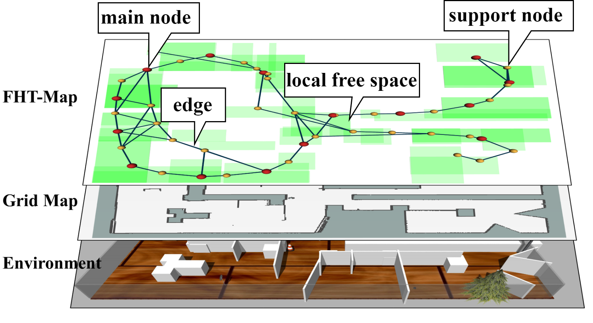

# FHT-Map

## News
- Apr. 16, 2024: FHT-Map is now open-sourced. If there are any bugs in this repository, don't hesitate to contact us.
- Apr. 14, 2024: Our work was accepted by RA-L.
- Jan. 10, 2024: FHT-Map is planned to be open-sourced.

## Overview
**FHT-Map** is a light-weight framework for building **F**eature-based **H**ybrid **T**opological **M**ap.
Our method is demonstrated to achieve faster relocalization and better path planning capability compared with state-of-the-art topological maps.

**FHT-Map** consists of two types of nodes: main node and support node.
Main nodes store visual information compressed by convolutional neural network and local laser scan data to enhance subsequent relocalization capability.
Support nodes retain a minimal amount of data to ensure storage efficiency while facilitating path planning.

Our video is released at [Bilibili](https://www.bilibili.com/video/BV12F4m1N7GL/?spm_id_from=333.999.0.0).

<p align="center">
  
</p>


<p align="center">
  
</p>

Real-world experiment is conducted using turtlebot burger with a D435i camera and a RPlidar A2 (12 m).
<p align="center">
  
</p>

# Quick Start
## Platform
- Ubuntu 20.04
- ROS noetic

## Denpendency
### Cartographer
Cartographer is a 2D/3D map-building method. It provides the submaps' and the trajectories' information when building the map. We use the pose of robot and grid map constructed by Cartographer to build FHT-Map.

We suggest that you can refer to [Cartographer-for-SMMR](https://github.com/efc-robot/Cartographer-for-SMMR) to install the modified Cartographer to ```carto_catkin_ws```

and 

```
source /PATH/TO/CARTO_CATKIN_WS/devel_isolated/setup.bash
```

### Turtlebot3 Description
```
sudo apt install ros-noetic-turtlebot3*
sudo apt-get install liborocos-bfl-dev
pip install future
sudo apt install ros-noetic-teb-local-planner
```

### Install Code for FHT-Map
```
mkdir ~/fht_map_ws/src && cd ~/fht_map_ws/src
git clone git@github.com:KunSong-L/FHT-Map.git
cd ..
catkin_make
source ./devel/setup.bash
```
We suggest that you can add *source ~/fht_map_ws/devel/setup.bash* to ~/.bashrc

## Simulations for constructing FHT-Map
Two different simulation environments (*Museum* and *office*) are provided in this repository.
To run our code, you need to open a simulation environment firstly.
```
roslaunch turtlebot3sim museum_env.launch
or
roslaunch turtlebot3sim office_env.launch
```

Then, you need to start the 2-D SLAM and move-base module for turtlebot.
```
roslaunch turtlebot3sim single_robot_origin.launch
```

Finally, you can start the process of constructing FHT-Map.
```
roslaunch fht_map fht_map_cons.launch
```
When the robot exploration process is finished, our code will record a FHT-Map automatically. You can use this map for relocalization and path planning subsequently.

## Simulations for relocalization
Take relocalization in *museum* as an example.
```
roslaunch turtlebot3sim museum_env.launch
roslaunch turtlebot3sim single_robot_origin.launch
roslaunch fht_map robot_relocalization.launch
```
Then, you need to play the rosbag to transfer the already constructed FHT-Map to the relocalization method.
```
roscd fht_map && rosbag play ./bag/museum_fht_map.bag --topics /robot1/topomap
```

## Simulations for Path Planning
Take path planning in *museum* as an example.
```
roslaunch turtlebot3sim museum_env.launch
roslaunch turtlebot3sim single_robot_origin.launch
roslaunch fht_map robot_navigation.launch
```
Then, you need to play the rosbag to transfer the already constructed FHT-Map to the path planning method.
```
roscd fht_map && rosbag play ./bag/museum_fht_map.bag --topics /robot1/topomap
```

# Code Overview
We will introduce our code briedfly. Our FHT-Map construction algorithm is realized in *robot.py*. The most important function in this file is *map_panoramic_callback*. In this funciton, we will check that whether we need to create a node or not.
Some other important functions are explained below:
- *find_better_path_callback*: map refinement module mentioned in the paper
- *map_grid_callback*: for robot autonomous exploration

The code for relocalization and path planning is similar with *robot.py*.
# Citation
If you use this code for your research, please cite our papers. *https://arxiv.org/abs/2310.13899*

```
@article{song2023fht,
  title={FHT-Map: Feature-based Hierarchical Topological Map for Relocalization and Path Planning},
  author={Song, Kun and Liu, Wenhang and Chen, Gaoming and Xu, Xiang and Xiong, Zhenhua},
  journal={arXiv preprint arXiv:2310.13899},
  year={2023}
}
```
